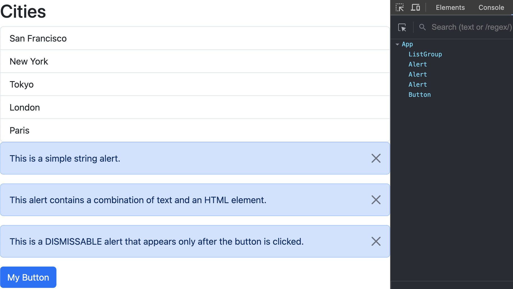

# ReactApp

## Overview

- Description: A mini project inspired by the [React Tutorial for Beginners](https://www.youtube.com/watch?app=desktop&v=SqcY0GlETPk&ab_channel=ProgrammingwithMosh) YouTube video, designed to teach the basics of React.
- Component tree:
  

## Setup

1. Start a new Vite project by automating the setup and configuration steps: `npm create vite@4.1.0`
   - project creation tool: Vite
   - framework: React
   - variant: Typescript
2. (For project isolation) create & activate a virtual environment (dependencies are installed within the virtual environment other than system-wide & all subsequent steps will be performed within the virtual environment):
   ```
   python -m venv .venv
   source .venv/bin/activate
   ```
3. Install all the dependencies and devDependencies listed in the `package.json` file: `npm install` or `npm i`
4. Install the Bootstrap library: `npm i bootstrap@5.3.3`
5. Run a development web server for the projec: `npm run dev`

## Notes

1. How React works?

   | Component Tree: | Virtual DOM: | Actual DOM: |
   | --------------- | ------------ | ----------- |
   | App (root)      | `<div>`      | `<div>`     |
   | Message (child) | `<h1>`       | `<h1>`      |

   - When the state of a component changes, React updates the corresponding node in the virtural DOM to reflect the new state.
   - Then it compares the current version of virtual DOM with the previous version to identify the nodes that should be updated in the actual DOM.
   - Updating the DOM is done by React DOM (the companion library).

2. Library (React) vs. framework?

   - Library: a tool that provides specific functionality
     - React: a library/tool for creating dynamic and interactive UIs (user interfaces)
   - Framework: **_a set of tools and guidelines_** for building apps

3. React ecosystem:
   - Building components:
     - Note: a React component cannot return more than one element unless wrapped all children with <div></div> or <Fragment></Fragment> or `<></>` to create a single parent element.
     - JSX expressions must have one parent element.
   - Render list in markup with JSX:
     - JSX (JavaScript XML) is a syntactic sugar for function calls and object creation in JavaScript.
     - In JSX, we can only use html elements or other React components.
   - Conditional rendering:
     - true && 1 -> 1
     - true && "Qingying" -> "Qingying"
     - false && "Qingying" -> false (no rendering on screen)
   - Manage state changes:
     - using **_state hooks_** in the format **_[variable, updater_function]_**
     - Note: each component instance maintains its own state (independent of each other)
   - Props (properties) make component reusable:
     - Pass data to components via props
     - Pass function(s) to components via props
   - State vs. props:
     - State: data managed by a component (similar to local variables)
     - Props: input passed to a component (similar to func arguments)
     - Difference: State is mutable on purpose (data can change over time) while props are immutable (cannot be changed)
     - Common: Anytime they change will re-render the component, and update the DOM accordingly.
   - Pass a child component (`Alert.tsx`) to the root component (`App.tsx`)
   - Pass long text or html content as a child to the component
   - React developer tools:

- React dev tools:
  - View component tree via the React Dev Tools extension:
    
  - Search a component:
    
  - Inspect matching DOM element:
    
  - View component source code:
    

## Resources

1. [Tutorial video](https://www.youtube.com/watch?app=desktop&v=SqcY0GlETPk&ab_channel=ProgrammingwithMosh)
2. [Bootstrap | Components](https://getbootstrap.com/)
3. [Bootstrap | dismiss an alert](https://getbootstrap.com/docs/5.3/components/alerts/#dismissing)
